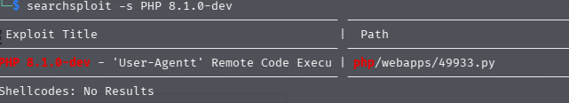
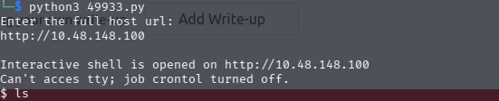

after getting the url and opeoing into the browser this was our first look


the source code did gave us a only a handful of domains.

this the nmap result

```
Starting Nmap 7.98 ( https://nmap.org ) at 2026-04-25 23:01 +0530
Nmap scan report for 10.48.148.100
Host is up (0.063s latency).
Not shown: 999 closed tcp ports (reset)
PORT   STATE SERVICE VERSION
80/tcp open  http    PHP cli server 5.5 or later (PHP 8.1.0-dev)
|_http-title:  Admin Dashboard
Device type: general purpose
Running: Linux 4.X|5.X
OS CPE: cpe:/o:linux:linux_kernel:4 cpe:/o:linux:linux_kernel:5
OS details: Linux 4.15 - 5.19
Network Distance: 3 hops

```

Now this result meanin we could do somethign with PHP cli server 5.5 or later (PHP 8.1.0-dev)


when i search for exploit for it 

```searchsploit -s PHP 8.1.0-dev ```



it was clearly visible so i copied it with

```searchsploit -m 49933 ```

and used it it asked me for enter the fullhost url:

I entered it into the format http://ip

Then quicly after it i got the shell



when i cheked for id and whoami i was root but i was not able to move forwasrd or backward in file system. i was only able to read only few file

and inside the current folder only i was allowed in to read files of it.

But then i searched the whole filesystem for text files.

with the commadn 

```
find / -type f -name "*.txt" 2>/dev/null
```

And one of the entry was flag.txt

when i get i i was able to peek inside nad i got the flag
