<div align="center">

<!-- TryHackMe Badge -->


<br/><br/>

# 🐛 Bugged — TryHackMe Writeup

### *Network Enumeration · SSH Brute Force · Credential Access*

<br/>

[](https://tryhackme.com)
[](https://tryhackme.com)
[](https://tryhackme.com)
[](https://github.com/vanhauser-thc/thc-hydra)
[](https://nmap.org)

<br/>


</div>

---

## 📋 Table of Contents

| # | Section |
|:---:|:---|
| 1 | [🌐 Room Overview](#-room-overview) |
| 2 | [🔍 Initial Reconnaissance](#-initial-reconnaissance) |
| 3 | [🗺️ Nmap Port Scan](#-nmap-port-scan) |
| 4 | [💡 Strategy — Why Brute Force?](#-strategy--why-brute-force) |
| 5 | [💥 SSH Brute Force with Hydra](#-ssh-brute-force-with-hydra) |
| 6 | [🏁 Q1 — What is the flag?](#-q1--what-is-the-flag) |
| 7 | [📚 Key Takeaways](#-key-takeaways) |

---

## 🌐 Room Overview

**Bugged** is a TryHackMe room themed around IoT (Internet of Things) network traffic analysis. The premise: John's smart home appliances are generating suspicious network communications, and the challenge is to dig in and figure out what's going on.

The room hints at **MQTT** — the *Message Queuing Telemetry Transport* protocol — a lightweight publish/subscribe messaging protocol that sits at the heart of most smart home and IoT device communications. Under normal circumstances, the intended approach for this room would involve subscribing to the MQTT broker and intercepting messages flying between John's connected devices. The flag would be tucked somewhere inside that traffic.

But the path to the flag doesn't always follow the scripted route. 🙂

---

## 🔍 Initial Reconnaissance

After grabbing the machine's IP address, the first natural instinct was to open it in a browser and see what was running on port 80.

The result?

```
ERR_CONNECTION_REFUSED
```

Chrome's most charming error message. No web service is exposed — which already tells us a great deal. Whatever is interesting on this machine isn't going to show up through a browser tab. Time to pull out the proper tools and scan properly.

---

## 🗺️ Nmap Port Scan

A full version-detection scan to map out exactly what's listening on the machine:

```bash
nmap -sV -sC -O 10.49.190.65
```

**Full scan output:**

```
Starting Nmap 7.99 ( https://nmap.org ) at 2026-04-29 15:08 +0530
Nmap scan report for 10.49.190.65
Host is up (0.061s latency).
Not shown: 999 closed tcp ports (reset)
PORT   STATE SERVICE VERSION
22/tcp open  ssh     OpenSSH 8.2p1 Ubuntu 4ubuntu0.13 (Ubuntu Linux; protocol 2.0)
| ssh-hostkey: 
|   3072 e0:91:69:a5:27:b4:b5:75:4c:1c:c4:47:8f:79:e6:70 (RSA)
|   256 0f:29:e7:da:35:25:a5:b1:b7:65:a0:48:15:10:3c:78 (ECDSA)
|_  256 58:d0:14:99:ba:b6:41:73:19:a8:ef:ec:3d:4e:75:d4 (ED25519)
No exact OS matches for host (If you know what OS is running on it, see https://nmap.org/submit/ ).
TCP/IP fingerprint:
OS:SCAN(V=7.99%E=4%D=4/29%OT=22%CT=1%CU=41722%PV=Y%DS=3%DC=T%G=Y%TM=69F1D1A
OS:0%P=x86_64-pc-linux-gnu)SEQ(SP=100%GCD=1%ISR=102%TI=Z%CI=Z%II=I%TS=A)SEQ
OS:(SP=104%GCD=1%ISR=10E%TI=Z%CI=Z%II=I%TS=A)SEQ(SP=107%GCD=3%ISR=109%TI=Z%
OS:CI=Z%II=I%TS=A)SEQ(SP=FC%GCD=1%ISR=100%TI=Z%CI=Z%II=I%TS=A)SEQ(SP=FC%GCD
OS:=1%ISR=104%TI=Z%CI=Z%II=I%TS=A)OPS(O1=M4E8ST11NW7%O2=M4E8ST11NW7%O3=M4E8
OS:NNT11NW7%O4=M4E8ST11NW7%O5=M4E8ST11NW7%O6=M4E8ST11)WIN(W1=F4B3%W2=F4B3%W
OS:3=F4B3%W4=F4B3%W5=F4B3%W6=F4B3)ECN(R=Y%DF=Y%T=40%W=F507%O=M4E8NNSNW7%CC=
OS:Y%Q=)T1(R=Y%DF=Y%T=40%S=O%A=S+%F=AS%RD=0%Q=)T2(R=N)T3(R=N)T4(R=Y%DF=Y%T=
OS:40%W=0%S=A%A=Z%F=R%O=%RD=0%Q=)T5(R=Y%DF=Y%T=40%W=0%S=Z%A=S+%F=AR%O=%RD=0
OS:%Q=)T6(R=Y%DF=Y%T=40%W=0%S=A%A=Z%F=R%O=%RD=0%Q=)T7(R=Y%DF=Y%T=40%W=0%S=Z
OS:%A=S+%F=AR%O=%RD=0%Q=)U1(R=Y%DF=N%T=40%IPL=164%UN=0%RIPL=G%RID=G%RIPCK=G
OS:%RUCK=G%RUD=G)IE(R=Y%DFI=N%T=40%CD=S)

Network Distance: 3 hops
Service Info: OS: Linux; CPE: cpe:/o:linux:linux_kernel
```

Only **port 22 (SSH)** is open. No MQTT broker on port 1883, no HTTP, no FTP — nothing else exposed to the network. Even though the room is framed as an IoT/MQTT challenge, the only attack surface accessible from outside is the SSH daemon running **OpenSSH 8.2p1** on Ubuntu.

---

## 💡 Strategy — Why Brute Force?

This was the real decision point. The typical approach to this room involves subscribing to the local MQTT broker and inspecting the messages flowing between John's smart devices. In theory, the flag would be embedded in one of those topic messages. But with only SSH exposed and no MQTT port reachable from outside, I had two real options:

1. Find a way to interact with the MQTT broker *through* SSH — which would require credentials first anyway
2. Hit the SSH daemon directly with a brute force attack using solid wordlists

Given that **SecLists** was available locally — one of the most comprehensive and well-maintained collections of security testing wordlists in existence — option two was clearly the faster path. CTF machines, particularly those rated Easy, very often use common, dictionary-guessable credentials. A targeted brute force with a quality wordlist takes minutes, not hours.

So rather than overcomplicating things, I kept it clean and direct. 🎯

---

## 💥 SSH Brute Force with Hydra

**Hydra** is the industry-standard network login cracker. It's fast, reliable, supports dozens of protocols natively, and pairs perfectly with SecLists wordlists for credential attacks.

Here is the command used:

```bash
hydra -L /home/Seclists/Usernames/top-usernames-shortlist.txt \
      -P /home/Seclists/Passwords/Common-Credentials/xato-net-10-million-passwords.txt \
      ssh://10.48.156.200 -t 4
```

**Parameter breakdown:**

| Parameter | Purpose |
|:---|:---|
| `-L <file>` | Load a **username list** — one username to try per line |
| `-P <file>` | Load a **password list** — one password to try per line |
| `ssh://10.48.156.200` | Target protocol (`ssh`) and IP address of the machine |
| `-t 4` | Limit to **4 parallel threads** — avoids triggering SSH rate limiting or fail2ban |

**Why keep threads low at `-t 4`?**

SSH connections carry overhead — they involve a full cryptographic handshake for every attempt. Throwing too many parallel connections at an SSH daemon at once tends to cause resets, dropped connections, or worse — getting your IP temporarily locked out by the server's rate limiting. Four threads is the sweet spot: fast enough to get results in reasonable time, conservative enough to stay under the radar.

**Wordlists used:**

- 📋 **`top-usernames-shortlist.txt`** — A short, tight list of the most commonly seen system usernames: `root`, `admin`, `ubuntu`, `john`, `user`, `pi`, and so on. Perfect for CTF machines that follow predictable naming conventions.
- 🔑 **`xato-net-10-million-passwords.txt`** — A massive, real-world password list sourced from actual breach data. If someone is reusing a weak or common password, it's almost certainly in this list.

<div align="center">

<br/>



*↑ Self-made 2D terminal animation — Hydra finding the valid SSH credential pair*

<br/>

</div>

Hydra worked through the combinations and came back with a valid **username and password pair**. From there, logging in via SSH was completely straightforward:

```bash
ssh <username>@10.48.156.200
```

Once inside, a quick look around the home directory was all it took. No privilege escalation needed — the flag was sitting right there, accessible under the compromised user account.

```bash
ls
cat flag.txt
```

---

## 🏁 Q1 — What is the flag? 🚩

> **Flag captured successfully via SSH shell after brute forcing credentials with Hydra. ✅**

The flag was located in the home directory of the compromised user, readable immediately upon gaining the initial SSH shell. Clean and simple.

---

## 📚 Key Takeaways

This room is a solid reminder of several core penetration testing principles that apply far beyond CTF environments:

- 🔍 **Always enumerate first** — Nmap before anything else. Knowing exactly which ports are open shapes every subsequent decision. Assumptions without scanning are guesses.

- 🎯 **Adapt your approach to the attack surface** — The room advertises MQTT, but when the only open port is SSH, SSH becomes your way in. Real-world targets don't announce their intended entry point.

- 📖 **The right wordlist makes all the difference** — SecLists is not optional equipment; it's essential. A targeted, high-quality wordlist cuts brute force time from hours to minutes.

- 🔐 **Weak credentials remain a critical risk in 2026** — Default or guessable passwords on SSH daemons are still shockingly common, both in CTF labs and in production environments. This room demonstrates exactly why they matter.

- 🛡️ **Defender's perspective** — If you're hardening a system: enforce **key-based SSH authentication** and disable password login entirely (`PasswordAuthentication no` in `/etc/ssh/sshd_config`). Pair that with `fail2ban` for rate limiting and you've already neutralised most brute force vectors.

---

<div align="center">


*Happy hacking — ethically, legally, and relentlessly.* 🔐

<br/>

[](https://tryhackme.com/p/LinuxX)
[](https://github.com/212-del)

<br/>

*Made with ❤️ and a lot of late-night terminal sessions.*

</div>
