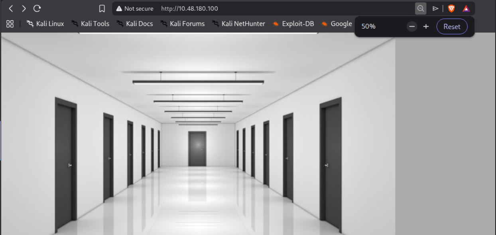
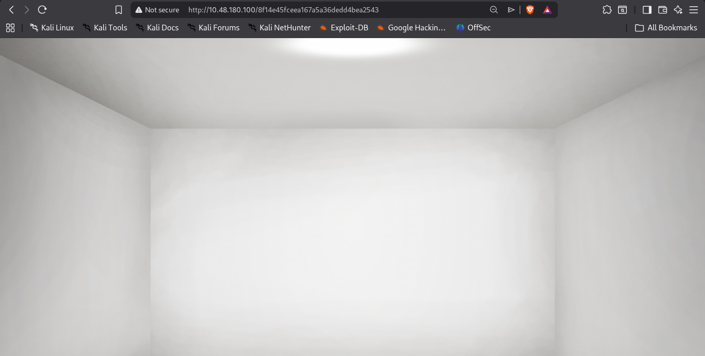

So My attempt is to whenever I get the IP I always hit the IP in the browser after all basic stuff that I already mentioned in Instruction.txt file.
So I opened http://ip
and saw a corridor.

There were total 13 doors in the corridor, all were clickable and after clicking each door, they landed me at different endpoints.
All endpoints visually look similar to the below picture

Moment of truth when you analyse those paths 
those paths are like below
http://ip/c4ca4238a0b923820dcc509a6f75849b
all were like this
you can view all via the source code

c4ca4238a0b923820dcc509a6f75849b when we decode such texts 
But for this we need to first identify what type of encoding it is.
You can search online or can use my repo https://github.com/212-del/Cybersecurity-calculator
and with it you can easily identify.
After identifying the hash type you can decode the decoding technique that corresponds to that encoding technique.
Search online for term  "<The encoding type you discovered> encoding decoder"
or easily go to https://crackstation.net/ and there paste the keyword and you get the meaning of that string <c4ca4238a0b923820dcc509a6f75849b> and 
after decoding all the strings you can connect the clues between each endpoint 
and since in room description it is simply written that it is IDOR VULNs. and also written that This could help you uncover website locations you were not expected to access.
so guess the endpoint and do hit and trial and you will get the flag if you hit the correct endpoint.
Then flag will be in front of you. 
Kudos to the Room Maker!!

