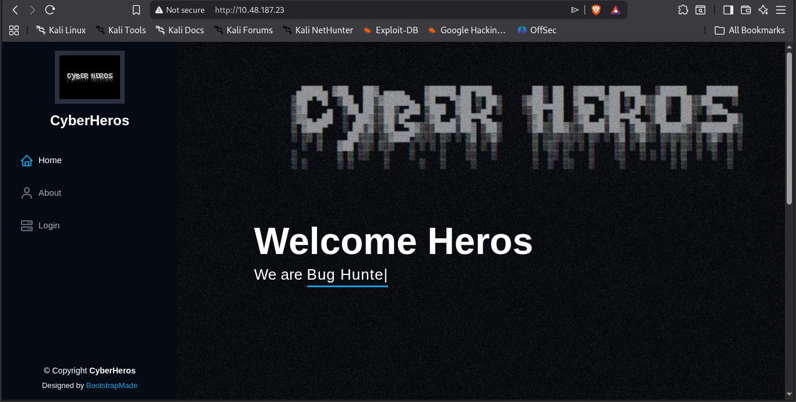

So after getting the ip and opening it into a new tab 

This was our first look our target



and see there is a login page first we will ping see its req with curl then we do bruteforcing on it.

But i was unaware of the login machenism that do a popup after entering the password.

So i tried looking the souce code

so i found this code somewhere it was

```js

 function authenticate() {
      a = document.getElementById('uname')
      b = document.getElementById('pass')
      const RevereString = str => [...str].reverse().join('');
      if (a.value=="h3ck3rBoi" & b.value==RevereString("54321@terceSrepuS")) { 
        var xhttp = new XMLHttpRequest();
        xhttp.onreadystatechange = function() {
          if (this.readyState == 4 && this.status == 200) {
            document.getElementById("flag").innerHTML = this.responseText ;
            document.getElementById("todel").innerHTML = "";
            document.getElementById("rm").remove() ;
          }
        };
        xhttp.open("GET", "RandomLo0o0o0o0o0o0o0o0o0o0gpath12345_Flag_"+a.value+"_"+b.value+".txt", true);
        xhttp.send();
      }
      else {
        alert("Incorrect Password, try again.. you got this hacker !")
      }
    }
```

Instruction for copilot: do explain better why guessing password was simple into simple words like a human is understading.
you can see the varible a is uname kindda username and varible b is a password kinda pass so 

if we then look at the if line the a value is definded that means username is definded but the b value is reversed so i flip it back and boom got the password.


After entering the password the flag was in front of us.

```text

Congrats Hacker, you made it !! Go ahead and nail other challenges as well :D REDACTED
```
