<div align="center">


<br/><br/>

# 📜 Letter — TryHackMe Writeup

### *Open Source Intelligence · Historical Research · Maritime Forensics*

<br/>

[](https://tryhackme.com)
[](https://tryhackme.com)
[](https://tryhackme.com)
[](https://tryhackme.com)

<br/>


</div>

---

## 🗂️ Table of Contents

| # | Section |
|:---:|:---|
| 1 | [📦 Extracting the Files](#-extracting-the-files) |
| 2 | [📝 Personal Note — Translation & Context](#-personal-note--translation--context) |
| 3 | [❓ Q1 — Postal Code of the Delivery Address](#-q1--what-is-the-postal-code-of-the-delivery-address-on-the-envelope) |
| 4 | [🏴 Q2 — The Flag](#-q2--what-is-the-flag) |
| 5 | [🔑 Key Takeaways](#-key-takeaways) |

---

## 📦 Extracting the Files

We start with a [zip file](Letter-1776082552563.zip).

<div align="center">

</div>

Inside the zip folder there are **3 files** and **1 folder**:

**Files:**

- `Notes.txt`
- `letter.png`
- `Newspaper-Clipping.png`

**Inside the folder named `__MACOSX`:**

- `._Notes.txt`
- `._letter.png`
- `._Newspaper-Clipping.png`

> 💡 The `__MACOSX` folder is a metadata artefact automatically generated by macOS when creating zip archives. It mirrors the real files with resource fork data but contains nothing investigatively useful — focus entirely on the three files above.

---

## 📝 Personal Note — Translation & Context

The content inside `Notes.txt` is written in **French**:

```
Mon cher Édouard,

Aujourd'hui, en rangeant le grenier chez mes grands-parents, je suis tombée sur cette vieille coupure de journal. Ton arrière-grand-père n'avait même pas l'âge de passer le permis quand il s'est distingué ce jour-là. Le benjamin de l'équipe, et certainement pas le moins courageux.

Il serait si fier de te voir sur l'eau à ton tour.

Avec toute mon affection,
Audette
```

Its English translation reads:

```
My dear Édouard,

Today, while tidying up the attic at my grandparents' house, I came across this old newspaper clipping. Your great-grandfather wasn't even old enough to get a driver's licence when he distinguished himself that day. The youngest member of the team, and certainly not the least courageous.

He would be so proud to see you out on the water in your turn.

With all my affection,
Audette
```

**Audette** (a French feminine name) is writing to **Édouard** about a newspaper clipping she found in her grandparents' home — a clipping that almost certainly relates to an act of exceptional bravery by Édouard's great-grandfather.

Two phrases immediately stand out as critical anchors for this investigation:

- **"Le benjamin de l'équipe"** — *the youngest member of the team/crew.* In French, *benjamin* is a widely used expression for the youngest person in a group, often the baby of the family or crew.
- **"n'avait même pas l'âge de passer le permis"** — *wasn't even old enough to get a driver's licence.* In France, the minimum driving age is 18, which firmly places him below that threshold at the time of the event.

Together, these two clues paint a clear picture: we are looking for a **teenager** who performed an act of bravery as part of a **crew** — most likely a maritime rescue team, given the SNSM reference on the envelope.

---

## ❓ Q1 — What is the postal code of the delivery address on the envelope?

<div align="center">

</div>

### 🗞️ Analysing the Newspaper Clipping

The clipping comes from the newspaper **_Ouest‑Éclair_**.

This is a real, historically documented French publication — the direct predecessor of **_Ouest-France_**, today one of the most widely circulated regional newspapers in France. Its distribution area was concentrated in:

- **Brittany (Bretagne)** — the rugged northwestern peninsula of France, jutting into the Atlantic
- **Western France** more broadly, including departments such as:
  - **Finistère** — the westernmost department of mainland France
  - Côtes-d'Armor
  - Morbihan

<div align="center">

| 🔍 Clue | 💡 What It Points To |
|:---|:---|
| 📰 Newspaper: *Ouest-Éclair* | Published and distributed in Brittany / Western France |
| ✉️ "SNSM" on the envelope | *Société Nationale de Sauvetage en Mer* — France's national sea rescue organisation |
| 💧 "sept noyés" in the clipping | *Seven drowned* — a documented lifeboat disaster |
| 📅 "Jeudi 28 Mai" | Thursday, 28 May — a date that maps to a specific historical tragedy |
| 👤 Addressee: "Edouard G." | Surname initial narrows the identity search considerably |

</div>

### ⚓ The SNSM Connection

The envelope is addressed to **"Edouard G."** at an **SNSM station**. The SNSM (*Société Nationale de Sauvetage en Mer*) is France's national sea rescue organisation, operating lifeboat stations along the country's Atlantic and Mediterranean coastlines. The mere presence of this address on the envelope confirms we are squarely in the domain of **maritime rescue on the French coast**.

### 🗺️ Narrowing It Down to Finistère

The **Finistère** department becomes the prime candidate for several converging reasons:

- It is the **westernmost point of mainland France**, exposed to the full force of Atlantic storms
- It carries a centuries-long **maritime culture**, with fishing villages, traditional seafaring communities, and lifeboat stations strung along its craggy coastline
- The *Ouest-Éclair* covered this region extensively and sympathetically
- The phrase **"sept noyés"** (seven drowned) matches accounts of a devastating tragedy well documented in Finistère's maritime history

<div align="center">


*Finistère — department 29, the westernmost corner of mainland France*

</div>

### 📍 Finding the Postal Code — Method 1: Brute Force

One approach is to compile all postal codes in the Finistère department (department code **29**) and test each one against the challenge. All Finistère postcodes begin with **29**. There are roughly 283 communes in Finistère, each with its own postcode — so systematic testing is feasible, though time-consuming.

By trying each postcode from the Finistère list, the correct answer is found at **29760**.

### 🔬 Method 2: Historical Research (Faster & More Satisfying)

The newspaper clipping is the real key here. *L'Ouest-Éclair* was a real regional French newspaper based in Brittany, and the details in the clipping — a lifeboat disaster, seven rescuers drowned, Finistère coast, dated "Jeudi 28 Mai" — point unmistakably to a well-documented historical tragedy: the **Penmarc'h lifeboat disaster of May 23, 1925**.

On that date, two rescue boats — one from **Kérity** and one from **Saint-Pierre** — capsized during a rescue operation in brutal conditions off the Finistère coast. Both Kérity and Saint-Pierre are small fishing villages within the commune of **Penmarc'h**, located in the Finistère department of Brittany.

Once Penmarc'h is confirmed as the location, a straightforward lookup of its postal code gives the answer immediately.

> 🟢 **Answer: `29760`**

---

## 🏴 Q2 — What is the flag?

<div align="center">

</div>

### 🔎 Historical Research — Identifying the Person

The letter describes Édouard's great-grandfather as **"the youngest member of the rescue crew"** — a teenager, below driving age. The event, as established above, is the **Penmarc'h lifeboat disaster of May 1925**.

At this point the investigation becomes a **historical records research problem**.

Of the two lifeboats involved that day, the one that managed to successfully rescue survivors was the **_Arche-d'Alliance_**. Examining the crew records from that vessel — and specifically looking for the youngest crew member — one name stands out clearly:

> **Yves-Marie Gourlaouen**, aged **15** — a *mousse* (ship's boy), the youngest person aboard. For his exceptional courage during the disaster, he was awarded a **silver medal**.

This discovery also ties back to the envelope. The addressee is **"Edouard G."** — the surname initial **G.** aligns directly with **Gourlaouen**, confirming Édouard's family name and closing the loop on the entire investigation.

### 🧩 Connecting the Dots

<div align="center">

| 🔗 Clue | ✅ Resolved As |
|:---|:---|
| "Edouard G." on the envelope | Édouard **G**ourlaouen |
| Great-grandfather was youngest crew member | Yves-Marie Gourlaouen, age **15** |
| Too young for a driver's licence | 15 years old — confirmed under 18 |
| Maritime bravery / rescue at sea | 1925 Penmarc'h lifeboat disaster |
| Silver medal award | Awarded to Yves-Marie Gourlaouen |
| Penmarc'h, Finistère | Postal code: **29760** |

</div>

### 🏆 Constructing the Flag

The room provides a formatting example in its flag structure:

```
THM{Pierre-Henry_Lagaffe_23}
```

Following that exact pattern — **hyphenated first name** · **underscore** · **surname** · **underscore** · **age at the time** — the flag becomes:

<div align="center">

```
THM{Yves-Marie_Gourlaouen_15}
```

</div>

> 🟢 **Answer: `THM{Yves-Marie_Gourlaouen_15}`**

---

## 🔑 Key Takeaways

<div align="center">

</div>

This room is an excellent example of how **OSINT doesn't always mean scraping social media profiles or spinning up recon tools**. Sometimes it's about reading carefully, understanding cultural and linguistic context, and knowing where historical records live.

A few things that carried the investigation:

- 🇫🇷 **French vocabulary was the first compass** — phrases like *"sept noyés"* and *"benjamin de l'équipe"* gave direction long before any tool was needed. Language skills are a genuine OSINT asset.

- ⚓ **The SNSM reference was a strong anchor** — it immediately scoped the entire search to maritime rescue along the French coastline, cutting out a huge amount of irrelevant noise.

- 📜 **Historical records did the heavy lifting** — once Penmarc'h was confirmed as the location, the documented crew list from the 1925 disaster provided name, age, and even the silver medal citation, without needing anything beyond careful research.

- 🔗 **Cross-referencing multiple sources painted the full picture** — no single source alone was sufficient. The newspaper name, the French vocabulary in the clipping, the SNSM address on the envelope, and Finistère maritime archives each contributed a piece of the puzzle. Cross-referencing is what tied them all together.

- 🧠 **The flag format was a hint in itself** — the example `THM{Pierre-Henry_Lagaffe_23}` signalled that the person had a hyphenated first name and that the age mattered. This confirmed that finding an exact historical individual was the actual goal, not just a location or date.

The broader lesson: **historical awareness and language skills are genuine OSINT superpowers.** Understanding the cultural weight of a phrase or the regional significance of a 100-year-old newspaper can cut hours off an investigation — and in this case, it was the difference between brute-forcing 283 postal codes and going straight to the answer.

---

<div align="center">


<br/><br/>

*Room complete. Flag captured. Another chapter written in the archive.* 📖🔐

<br/>

[](https://tryhackme.com/p/LinuxX)
[](https://github.com/212-del)

</div>
