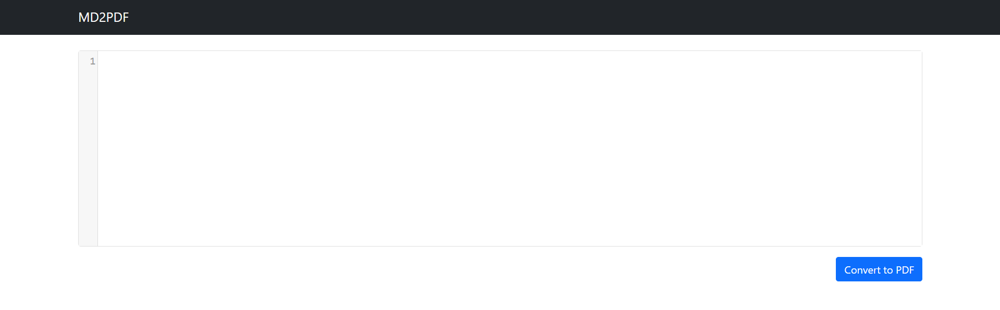
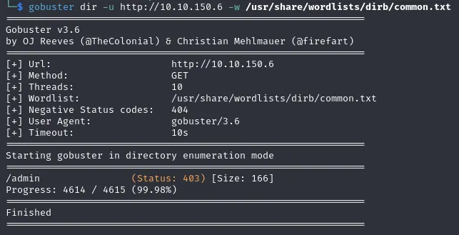
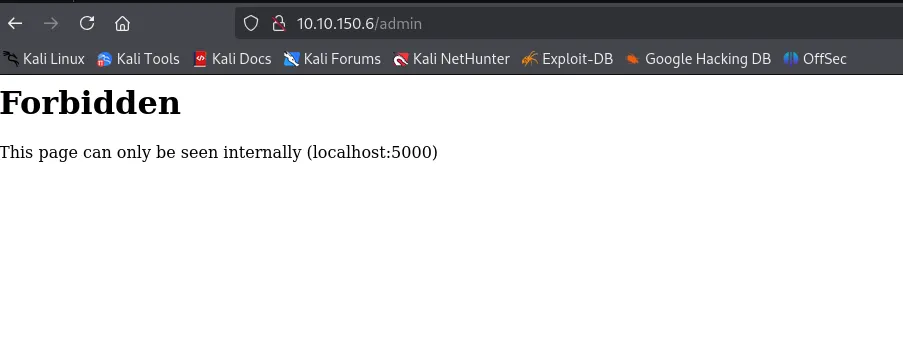

So after visiting the IP in browser http://10.49.152.161/, the page looks like a simple text-to-PDF converter with a single input field.



In its text field, when I entered some text and hit **Convert to PDF**, it went through some background process and returned a PDF file with the written text available to download.

Now, looking at the text field, the first thing that comes to mind is injecting something that triggers an effect.

So first I tried with normal text and nothing happened. But as I moved further and tried HTML injection, it got affected.

```html
<h2>Hello</h2>
```

The string "Hello" was rendered in big letters.


So I tried many payloads but nothing worked so far.

Then I decided to do directory enumeration on it.

The results were:



When visiting that endpoint, it was telling me that it's only accessible internally.



Since it could only be accessed internally, the only process running internally is our text getting converted to a PDF.

So we can convert that endpoint into a PDF, making it look like we are accessing the page directly.

With the payload:

```html
<iframe src="http://localhost:5000/admin"></iframe>
```

This presents the admin page to us, and the endpoint contains the flag.
