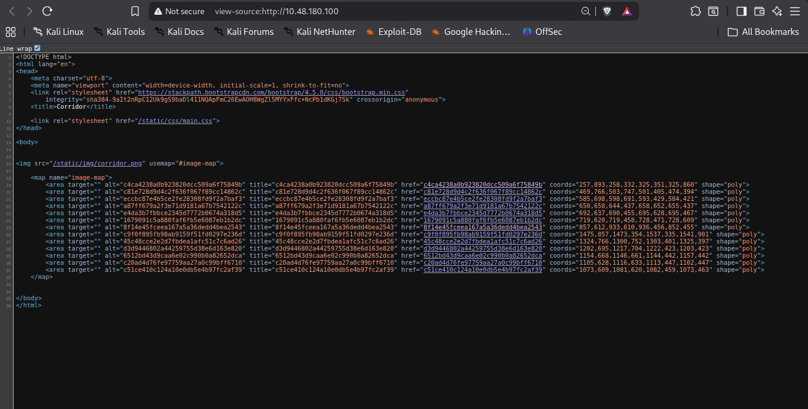

So My attempt is to whenever i got the ip i always hit the ip in browser after all basic stuffs that i already metioned in Instruction.txt file.
so i opened http://ip
and so a corridor.

There were total 13 doors in the corridors all were clickable and after clicking at each door they land me at different endpoints.
All endpoint visually looks similar to the below picture

moment of truth when you analyse those paths 
those paths are like below
http://ip/c4ca4238a0b923820dcc509a6f75849b
all were like this
you can view all via the source code

c4ca4238a0b923820dcc509a6f75849b when we decode such texts 
But for this we need to first identify what type of encoding it is.
You can search only or can use my repo https://github.com/212-del/Cybersecurity-calculator
and with it you can easliy identify.
After identifing the hash type you can decode the the decoding technique that corresponds to that encoding technique.
Search online for term  "<The encoding type you discoverd> encoding decoder"
or easily go to https://crackstation.net/ and there paste the keyword and you go the meaning of that string <c4ca4238a0b923820dcc509a6f75849b> and 
af...
