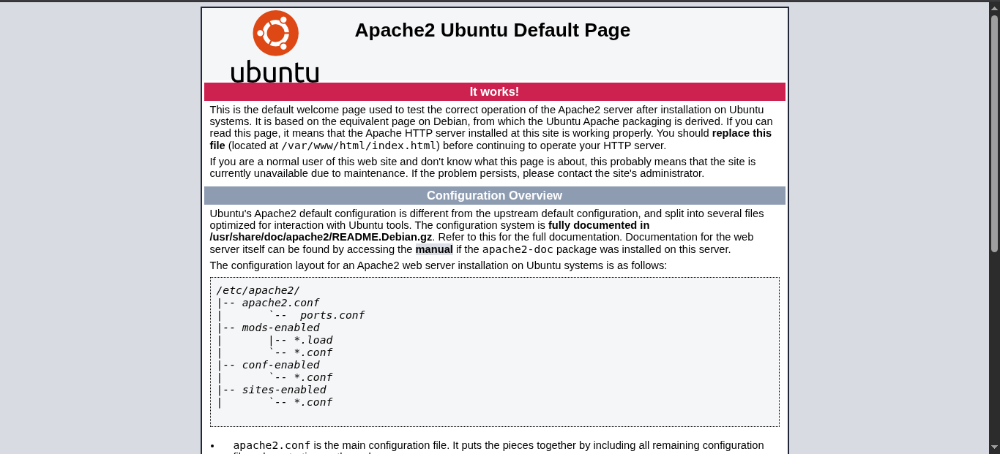
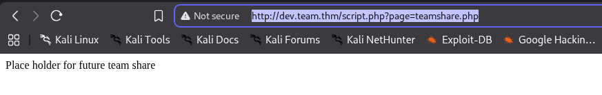

So after getting the ip we first opened it into the browser it serves as a default homepage of apache server



The nmap result was 

```
Starting Nmap 7.98 ( https://nmap.org ) at 2026-04-24 23:54 +0530
Nmap scan report for 10.49.150.162
Host is up (0.066s latency).
Not shown: 997 filtered tcp ports (no-response)
PORT   STATE SERVICE VERSION
21/tcp open  ftp     vsftpd 3.0.5
22/tcp open  ssh     OpenSSH 8.2p1 Ubuntu 4ubuntu0.13 (Ubuntu Linux; protocol 2.0)
| ssh-hostkey: 
|   3072 be:a9:f4:97:6b:f2:96:9a:ef:e9:74:4f:49:f0:99:34 (RSA)
|   256 7d:c1:57:5f:d4:c1:41:68:c5:b0:a6:bb:e7:cf:35:81 (ECDSA)
|_  256 6a:5d:ac:0f:47:4b:7d:c4:ad:d1:af:7c:70:dc:13:ad (ED25519)
80/tcp open  http    Apache httpd 2.4.41 ((Ubuntu))
|_http-title: Apache2 Ubuntu Default Page: It works! If you see this add 'te...
|_http-server-header: Apache/2.4.41 (Ubuntu)
Warning: OSScan results may be unreliable because we could not find at least 1 open and 1 closed port
Device type: general purpose|specialized|phone|storage-misc
Running (JUST GUESSING): Linux 4.X|5.X|3.X (91%), Crestron 2-Series (86%), Google Android 10.X|11.X|12.X (85%), HP embedded (85%)
OS CPE: cpe:/o:linux:linux_kernel:4 cpe:/o:linux:linux_kernel:5 cpe:/o:crestron:2_series cpe:/o:linux:linux_kernel:3 cpe:/o:google:android:10 cpe:/o:google:android:11 cpe:/o:google:android:12 cpe:/h:hp:p2000_g3
Aggressive OS guesses: Linux 4.15 - 5.19 (91%), Linux 4.15 (90%), Linux 5.4 (90%), Crestron XPanel control system (86%), Linux 3.8 - 3.16 (86%), Android 10 - 12 (Linux 4.14 - 4.19) (85%), HP P2000 G3 NAS device (85%)
No exact OS matches for host (test conditions non-ideal).
Network Distance: 3 hops
Service Info: OSs: Unix, Linux; CPE: cpe:/o:linux:linux_kernel

TRACEROUTE (using port 22/tcp)
HOP RTT      ADDRESS
1   66.16 ms 192.168.128.1
2   ...
3   72.30 ms 10.49.150.162

OS and Service detection performed. Please report any incorrect results at https://nmap.org/submit/ .
Nmap done: 1 IP address (1 host up) scanned in 26.81 seconds

```
Meaning we can do something with vsftpd 3.0.5 that is **CVE-2025-14242**

But we can't do anything with it is for the Ddos.

The important section in the source code i found was

```html
<title>Apache2 Ubuntu Default Page: It works! If you see this add 'team.thm' to your hosts!</title>

```

after doing so it opens up a completely different page. 

Meaning the page is using virtual hosting.


The robots.txt also exist there include one name *dale*.

When doing directory bruteforcing it gave us only those pages that were inside the source code.

But as it is said in the hint of question 1.

```
As the "dev" site is under contruction maybe it has some flaws? "url?=" + "This rooms picture" 
```

So first i did add dev.team.thm into the /etc/hosts file.

Then accessed the dev page.


Now there is a link when tapped onto it gave us irrelevent page but the url was not

```
http://dev.team.thm/script.php?page=teamshare.php
```



Here we can try for parameter tampering.

So we tried LFI paylods with ffuf
